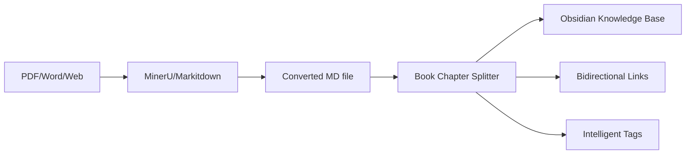

# Book Chapter Splitter

🧠 **An intelligent document splitting tool designed for knowledge workers**

Perfectly integrated with outputs from document processing tools like [MinerU](https://github.com/opendatalab/MinerU) and [Markitdown](https://github.com/microsoft/markitdown), this tool intelligently splits converted academic papers, technical documents, and books into manageable knowledge units, generating **Obsidian bi-directional links** and **intelligent tagging systems** with one click.

## ✨ Features

- 🔍 **Intelligent Structure Recognition**: Automatically recognizes Chinese chapter title formats (第一章、第二章, etc.)
- 📄 **Multi-level Splitting**: Supports hierarchical splitting of chapters and sections
- 🏷️ **Intelligent Tag Generation**: Automatically generates keyword tags based on TF-IDF and TextRank algorithms
- 📚 **Table of Contents Generation**: Automatically creates hierarchical table of contents
- 🧭 **Navigation Links**: Adds navigation links to return to table of contents for each file
- 🖼️ **Image Processing**: Automatically processes and copies image resources
- ⚙️ **Flexible Configuration**: Supports multiple configuration options and processing modes
- 🚀 **High Performance**: Optimized processing flow, supports large document processing
- 🛡️ **Error Handling**: Comprehensive error recovery and fault tolerance mechanisms
- 💻 **Command Line Interface**: Simple and easy-to-use CLI tool
- 🔗 **Native Obsidian Compatibility**: Automatically generates bi-directional links and YAML front matter in Obsidian format
- 📚 **Knowledge Graph Ready**: Output file structure directly supports Obsidian graph view and relationship analysis
- 🎯 **Automatic Backlinks**: Automatically establishes bidirectional reference relationships between related files

## 🔄 Typical Workflow



## ⚡ MinerU/Markitdown Special Optimization

### Special Processing for Converted Documents
- **Intelligent Recognition of Conversion Traces**: Automatically recognizes and handles special format markers after MinerU/Markitdown conversion
- **Image Path Repair**: Automatically fixes potential image path issues during conversion
- **Encoding Format Adaptation**: Intelligently handles potential encoding issues after conversion
- **Structure Enhancement**: Enhances document structure after conversion to improve readability

### Recommended Configuration
```bash
# Configuration optimized for MinerU output
python -m book_splitter -i mineru_output.md -o obsidian_vault \
    --sections --tags --navigation \
    --min-tags 3 --max-tags 8
```

## 🎯 Best Application Scenarios
- 📖 **Academic Research**: Convert PDF papers and academic works into manageable knowledge units
- 💻 **Technical Learning**: Process programming books and technical documents to build knowledge systems
- 📚 **Knowledge Management**: Build personal knowledge bases for structured knowledge storage
- 🔍 **Content Creation**: Provide structured material libraries for writing and research
- 🎓 **Teaching Preparation**: Split teaching materials into teaching units

## 🎯 Knowledge Management Best Practices

### 1. File Naming Strategy
- Use meaningful chapter titles
- Maintain naming consistency
- Utilize tags for multi-dimensional classification

### 2. Tag System Design
- **Topic Tags**: Indicate knowledge areas (e.g., #artificial-intelligence #economics)
- **Type Tags**: Indicate content types (e.g., #theory #case-study #method)
- **Status Tags**: Indicate learning status (e.g., #mastered #reviewing #to-explore)

### 3. Bi-directional Link Usage Suggestions
- Establish connections between related concepts
- Record personal understanding and reflections
- Build knowledge evolution paths

## 📦 Quick Start

### Environment Requirements

- Python 3.10+
- Supported operating systems: Windows, macOS, Linux

### Installation Steps

```bash
# Clone the project
git clone https://github.com/your-username/book-chapter-splitter.git
cd book-chapter-splitter

# Create virtual environment (Windows)
python -m venv .venv

# Install in editable mode
pip install -e .

# Install development dependencies
pip install -r requirements.txt
pip install pytest pytest-cov
```

### Main Dependencies

- `jieba`: Chinese word segmentation and keyword extraction
- `scikit-learn`: TF-IDF algorithm support
- `networkx`: TextRank algorithm support
- `click`: Command line interface

## 🚀 Quick Start

### Basic Usage

```bash
# Simplest usage - only split chapters
python -m book_splitter -i input.md -o output_dir --no-sections --no-tags --no-navigation

# Full functionality - split chapters and sections, generate tags and navigation (default enables all features)
python -m book_splitter -i input.md -o output_dir
```

### Input Document Format Requirements

Your markdown document should follow the following format:

**⚠️ Important Format Specification:**
- Chapter titles **must not contain underscores `_`**, please use spaces for separation
- Correct format: `# 第一章 Introduction: Objects and Status`
- Incorrect format: `# 第一章_Introduction: Objects and Status`
- If your document contains underscores, you can use our provided `fix_chapter_titles.py` tool for batch repair

📋 **For detailed format requirements, please refer to: [FORMAT_REQUIREMENTS.md](docs/FORMAT_REQUIREMENTS.md)**

**Traditional Format:**

```markdown
# Document Title

# 第一章 Chapter Title

Chapter content...

一、Section Title

Section content...

二、Section Title

Section content...

# 第二章 Another Chapter

More content...
```

**Newly Supported Format:**

```markdown
# Document Title

## 一、Chapter Title

Chapter content...

### （一）Section Title

Section content...

### （二）Section Title

Section content...

## 二、Another Chapter

More content...
```

Supported chapter formats:

- `# 第一章 Title`, `# 第二章 Title`, etc.
- `# 第1章 Title`, `# 第2章 Title`, etc.
- `## 一、Title`, `## 二、Title`, etc. (newly supported)

Supported section formats:

- `一、Title`, `二、Title`, etc.
- `1、Title`, `2、Title`, etc.
- `(一)Title`, `(二)Title`, etc.
- `### （一）Title`, `### （二）Title`, etc. (newly supported)

## 📖 Detailed Usage Instructions

### Command Line Options

```bash
python -m book_splitter [OPTIONS]

Options:
  -i, --input TEXT           Input markdown file path [default: full.md]
  -o, --output TEXT          Output directory path [default: output]
  -c, --config TEXT          Configuration file path
  --no-sections              Disable section splitting, only split chapters
  --no-tags                  Disable tag generation
  --no-navigation            Disable navigation links
  --min-tags INTEGER         Minimum number of tags per section
  --max-tags INTEGER         Maximum number of tags per section
  --help                     Show help information
```

### Usage Examples

#### 1. Basic Splitting (Chapters Only)

```bash
python -m book_splitter -i book.md -o output --no-sections
```

Generated structure:

```
output/
├── 目录.md
└── chapters/
    ├── 第一章_标题.md
    ├── 第二章_标题.md
    └── ...
```

#### 2. Complete Splitting (Chapters + Sections)

```bash
python -m book_splitter -i book.md -o output --sections
```

Generated structure:

```
output/
├── 目录.md
├── chapters/
│   ├── 第一章_标题.md
│   └── 第二章_标题.md
└── sections/
    ├── 1.1_标题.md
    ├── 1.2_标题.md
    ├── 2.1_标题.md
    └── ...
```

#### 3. Enable All Features

```bash
python -m book_splitter -i book.md -o output
```

Generated files will include:

- YAML front matter and tags
- Navigation links
- Processed image resources

#### 4. Custom Tag Count

```bash
python -m book_splitter -i book.md -o output --sections --tags --min-tags 2 --max-tags 5
```

### Output File Format

#### Example File with Tags

```markdown
---
title: "Political Power Theory"
type: "section"
section_title: "Political Power Theory"
chapter_title: "第一章 Political Science Basics"
level: 3
line_range: "45-78"
tags:
  - Political Power
  - Power Theory
  - Political Science
  - Social Sciences
---

# Political Power Theory

Political power is the core concept of political science research...

---

[← Return to Table of Contents](../目录.md) | _Section File_
```

#### Table of Contents File Example

```markdown
# Table of Contents

## 📚 Chapter List

### [第一章 Political Science Basics](chapters/第一章_政治学基础.md)

- [1.1 Political Power Theory](sections/1.1_政治权力理论.md)
- [1.2 Political System Analysis](sections/1.2_政治制度分析.md)

### [第二章 Political Behavior](chapters/第二章_政治行为.md)

- [2.1 Political Participation](sections/2.1_政治参与.md)
- [2.2 Political Culture](sections/2.2_政治文化.md)

## 📊 Document Statistics

- Total chapters: 2
- Total sections: 4
- Generated files: 7
- Processing time: 0.15 seconds
```

## ⚙️ Configuration File

You can create configuration files to save common settings:

### config.json

```json
{
  "output_dir": "output",
  "create_sections": true,
  "generate_tags": true,
  "add_navigation": true,
  "preserve_images": true,
  "min_tags_per_section": 3,
  "max_tags_per_section": 8,
  "filename_separator": "_"
}
```

### config.yaml

```yaml
output_dir: output
create_sections: true
generate_tags: true
add_navigation: true
preserve_images: true
min_tags_per_section: 3
max_tags_per_section: 8
filename_separator: "_"
```

Using configuration files:

```bash
python -m book_splitter -i book.md --config config.yaml
python -m book_splitter -i book.md --config config.json
```

## 🔧 Advanced Usage

### Python API

```python
from book_splitter import BookSplitter, ProcessingConfig

# Create configuration
config = ProcessingConfig()
config.source_file = "input.md"
config.output_dir = "output"
config.create_sections = True
config.generate_tags = True

# Create processor
splitter = BookSplitter(config)

# Process file
result = splitter.process()

if result['status'] == 'success':
    print(f"Processing complete! Generated {result['generated_files_count']} files")
else:
    print(f"Processing failed: {result['error']}")
```

### Batch Processing

```python
from book_splitter import BookSplitter, ProcessingConfig

config = ProcessingConfig()
config.create_sections = True
config.generate_tags = True

splitter = BookSplitter(config)

# Batch process multiple files
input_files = ["book1.md", "book2.md", "book3.md"]
results = splitter.process_batch(input_files, "batch_output")

for file_path, success in results.items():
    status = "Success" if success else "Failed"
    print(f"{file_path}: {status}")
```

## 🎯 Best Practices

### 1. Document Preparation

- Ensure chapter title formats are consistent
- Use standard Chinese numerals or Arabic numerals
- Maintain clear hierarchical structure

### 2. Performance Optimization

- For large documents (>10MB), consider disabling tag generation to improve speed
- Using SSD storage can significantly improve processing speed
- For batch processing, recommend using smaller batch sizes

### 3. File Management

- Regularly clean up output directories
- Use meaningful output directory names
- Backup original documents

## 🐛 Troubleshooting

### Common Issues

#### 1. Chapters Not Recognized

**Problem**: After processing, shows "No valid chapter structure found"

**Solutions**:

- Check if chapter title format is correct
- Ensure using `# 第一章` or `# 第1章` format
- Verify document encoding is UTF-8

#### 2. Tag Generation Failure

**Problem**: Generated tags are of poor quality or insufficient quantity

**Solutions**:

- Adjust `--min-tags` and `--max-tags` parameters
- Ensure document content is rich enough
- Check if jieba word segmentation library is installed

#### 3. Filenames with Special Characters

**Problem**: Generated filenames contain unsupported characters

**Solutions**:

- The tool automatically cleans special characters
- If problems persist, check original title format
- You can manually rename generated files

#### 4. High Memory Usage

**Problem**: Insufficient memory when processing large documents

**Solutions**:

- Disable tag generation (`--no-tags`)
- Process large documents in batches
- Increase system memory or use virtual memory

### Error Codes

- `FileNotFoundError`: Input file does not exist
- `ValueError`: Document format is incorrect or has no chapter structure
- `PermissionError`: Insufficient permissions for output directory
- `MemoryError`: Insufficient memory

### Getting Help

If you encounter problems, you can:

1. Check detailed error logs
2. Use `--help` to view all options
3. Try minimal configuration testing
4. Check if document format meets requirements

## 🧪 Testing

### Running Tests

```bash
# Run all tests
python -m pytest tests/ -v

# Run specific test modules
python -m pytest tests/test_integration.py -v
python -m pytest tests/test_tag_generator.py -v

# Run specific test functions
python -m pytest tests/test_integration.py::test_end_to_end_processing -v

# Run tests with coverage
python -m pytest tests/ --cov=book_splitter --cov-report=html
```

### Test Coverage

```bash
pip install pytest-cov
python -m pytest tests/ --cov=book_splitter --cov-report=html
```

## 📁 Project Structure

```
book-chapter-splitter/
├── README.md                          # Project documentation
├── requirements.txt                   # Python dependency list
├── setup.py                          # Installation configuration
├── run_splitter.py                   # Quick run script
├── config.example.json               # Configuration file example
├── config.example.yaml               # Configuration file example (YAML)
├── .gitignore                        # Git ignore file configuration
├── LICENSE                           # Project license
├── .github/                          # GitHub workflow configuration
│   └── workflows/
│       └── python-tests.yml          # Automated testing configuration
├── docs/                             # Documentation directory
│   ├── FORMAT_SUPPORT.md             # Supported format documentation
│   ├── TECHNICAL_CHANGES.md          # Technical change documentation
│   ├── FORMAT_REQUIREMENTS.md        # Format requirements specification
│   ├── USAGE.md                      # Detailed usage guide
│   ├── TROUBLESHOOTING.md            # Troubleshooting guide
│   ├── CHANGELOG.md                  # Update log
│   ├── PROJECT_SUMMARY.md            # Project summary document
│   └── DOCUMENTATION_UPDATE_SUMMARY.local.md  # Documentation update summary
├── data/                             # Data file directory
│   └── demo.md                       # Demo data file
├── src/                              # Source code directory
│   └── book_splitter/
│       ├── __init__.py               # Package initialization
│       ├── __main__.py               # Module entry point
│       ├── main.py                   # Main processor
│       ├── config.py                 # Configuration management
│       ├── cli.py                    # Command line interface
│       ├── analyzers/                # Structure analyzers
│       │   └── structure_analyzer.py
│       ├── extractors/               # Content extractors
│       │   └── content_extractor.py
│       ├── generators/               # Generators
│       │   ├── tag_generator.py      # Tag generator
│       │   └── file_generator.py     # File generator
│       ├── managers/                 # Managers
│       │   └── link_manager.py       # Link manager
│       ├── models/                   # Data models
│       │   └── __init__.py
│       └── utils/                    # Utility functions
│           └── __init__.py
├── tools/                            # Tool scripts directory
│   ├── README.md                     # Tool usage instructions
│   └── fix_chapter_titles.py         # Chapter title format repair tool
└── tests/                            # Test file directory
    ├── __init__.py
    ├── test_basic.py                 # Basic functionality tests
    ├── test_structure_analyzer.py    # Structure analyzer tests
    ├── test_content_extractor.py     # Content extractor tests
    ├── test_tag_generator.py         # Tag generator tests
    ├── test_file_generator.py        # File generator tests
    ├── test_link_manager.py          # Link manager tests
    ├── test_integration.py           # Integration tests
    └── test_*.py                     # Other test files

Note:
- input*/ and output*/ directories are dynamically created during use and are configured to be ignored in .gitignore
- IDE configuration files, cache directories, and other automatically generated files by tools are configured to be ignored in .gitignore and not included in version control
```

## 🤝 Contributing

Contributions are welcome! Please follow these steps:

1. Fork the project
2. Create a feature branch (`git checkout -b feature/AmazingFeature`)
3. Commit your changes (`git commit -m 'Add some AmazingFeature'`)
4. Push to the branch (`git push origin feature/AmazingFeature`)
5. Create a Pull Request

### Development Environment Setup

```bash
# Clone the project
git clone https://github.com/your-username/book-chapter-splitter.git
cd book-chapter-splitter

# Create virtual environment
python -m venv .venv
source .venv/bin/activate  # On Windows: .venv\Scripts\activate

# Install in editable mode
pip install -e .

# Install development dependencies
pip install -r requirements.txt
pip install pytest pytest-cov black flake8
```

### Code Style

This project uses:
- `black` for code formatting
- `flake8` for linting

```bash
# Format code
black src/ tests/

# Check code style
flake8 src/ tests/
```

## 📄 License

This project is licensed under the MIT License - see the [LICENSE](LICENSE) file for details.

## 🙏 Acknowledgments

- [MinerU](https://github.com/opendatalab/MinerU) for excellent PDF parsing capabilities
- [Markitdown](https://github.com/microsoft/markitdown) for document conversion support
- [Obsidian](https://obsidian.md/) for inspiring the knowledge management approach
- All contributors and users of this project

## 📞 Contact

If you have any questions or suggestions, please feel free to:
- Submit an [Issue](https://github.com/your-username/book-chapter-splitter/issues)
- Send a [Pull Request](https://github.com/your-username/book-chapter-splitter/pulls)
- Contact us via [email](mailto:your-email@example.com)

---

⭐ If this project is helpful to you, please give us a star!