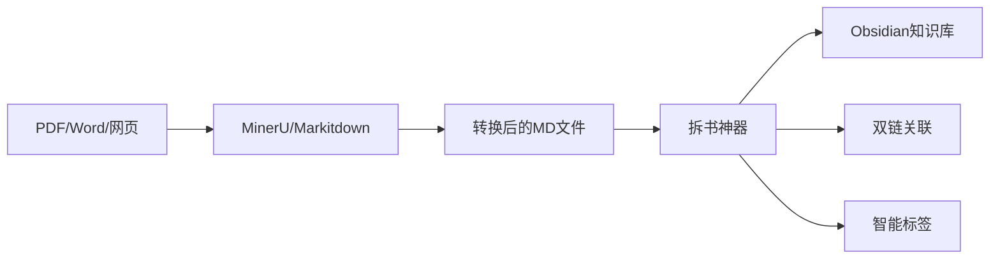

# 拆书神器 (Book Chapter Splitter)

🧠 **专为知识工作者设计的智能文档拆分工具**

完美对接 [MinerU](https://github.com/opendatalab/MinerU)、[Markitdown](https://github.com/microsoft/markitdown) 等文档处理工具的输出，将转换后的学术文献、技术文档、书籍资料智能拆分为可管理的知识单元，一键生成 **Obsidian 双链笔记** 和 **智能标签体系**。

## ✨ 功能特性

- 🔍 **智能结构识别**: 自动识别中文章节标题格式（第一章、第二章等）
- 📄 **多级拆分**: 支持章节和小节的层次化拆分
- 🏷️ **智能标签生成**: 基于 TF-IDF 和 TextRank 算法自动生成关键词标签
- 📚 **目录生成**: 自动创建层次化的目录文档
- 🧭 **导航链接**: 为每个文件添加返回目录的导航链接
- 🖼️ **图片处理**: 自动处理和复制图片资源
- ⚙️ **灵活配置**: 支持多种配置选项和处理模式
- 🚀 **高性能**: 优化的处理流程，支持大文档处理
- 🛡️ **错误处理**: 完善的错误恢复和容错机制
- 💻 **命令行界面**: 简单易用的 CLI 工具
- 🔗 **Obsidian原生兼容**: 自动生成符合Obsidian格式的双链链接和YAML前置元数据
- 📚 **知识图谱就绪**: 输出的文件结构直接支持Obsidian图谱视图和关系分析
- 🎯 **反向链接自动**: 自动在相关文件间建立双向引用关系

## 🔄 典型工作流程



## ⚡ MinerU/Markitdown专用优化

### 针对转换文档的特殊处理
- **智能识别转换痕迹**: 自动识别和处理MinerU/Markitdown转换后的特殊格式标记
- **图片路径修复**: 自动修正转换过程中可能出现的图片路径问题
- **编码格式适配**: 智能处理转换后可能出现的编码问题
- **结构增强**: 对转换后的文档结构进行增强，提升可读性

### 推荐配置
```bash
# 针对MinerU输出优化的配置
python -m book_splitter -i mineru_output.md -o obsidian_vault \
    --sections --tags --navigation \
    --min-tags 3 --max-tags 8
```

## 🎯 最佳应用场景
- 📖 **学术研究**: 将PDF论文、学术著作转换为可管理的知识单元
- 💻 **技术学习**: 处理编程书籍、技术文档，建立知识体系
- 📚 **知识管理**: 构建个人知识库，实现知识的结构化存储
- 🔍 **内容创作**: 为写作和研究提供结构化的素材库
- 🎓 **教学准备**: 将教材资料拆分为教学单元

## 🎯 知识管理最佳实践

### 1. 文件命名策略
- 使用有意义的章节标题
- 保持命名一致性
- 利用标签进行多维度分类

### 2. 标签体系设计
- **主题标签**: 标明知识领域（如#人工智能 #经济学）
- **类型标签**: 标明内容类型（如#理论 #案例 #方法）
- **状态标签**: 标明学习状态（如#已掌握 #复习中 #待深入）

### 3. 双链使用建议
- 在相关概念间建立连接
- 记录个人理解和思考
- 构建知识演进路径

## 📦 快速开始

### 环境要求

- Python 3.10+
- 支持的操作系统：Windows、macOS、Linux

### 安装步骤

```bash
# 克隆项目
git clone https://github.com/your-username/book-chapter-splitter.git
cd book-chapter-splitter

# 创建虚拟环境（Windows）
python -m venv .venv

# 安装可编辑模式
pip install -e .

# 安装开发依赖
pip install -r requirements.txt
pip install pytest pytest-cov
```

### 主要依赖

- `jieba`: 中文分词和关键词提取
- `scikit-learn`: TF-IDF 算法支持
- `networkx`: TextRank 算法支持
- `click`: 命令行界面

## 🚀 快速开始

### 基本用法

```bash
# 最简单的用法 - 只拆分章节
python -m book_splitter -i input.md -o output_dir --no-sections --no-tags --no-navigation

# 完整功能 - 拆分章节和小节，生成标签和导航（默认启用所有功能）
python -m book_splitter -i input.md -o output_dir
```

### 输入文档格式要求

您的 markdown 文档应该遵循以下格式：

**⚠️ 重要格式规范：**
- 章节标题中**不能包含下划线 `_`**，请使用空格分隔
- 正确格式：`# 第一章 导论：对象和地位`
- 错误格式：`# 第一章_导论：对象和地位`
- 如果您的文档包含下划线，可以使用我们提供的 `fix_chapter_titles.py` 工具进行批量修复

📋 **详细格式要求请参考：[FORMAT_REQUIREMENTS.md](docs/FORMAT_REQUIREMENTS.md)**

**传统格式：**

```markdown
# 文档标题

# 第一章 章节标题

章节内容...

一、小节标题

小节内容...

二、小节标题

小节内容...

# 第二章 另一个章节

更多内容...
```

**新支持格式：**

```markdown
# 文档标题

## 一、章节标题

章节内容...

### （一）小节标题

小节内容...

### （二）小节标题

小节内容...

## 二、另一个章节

更多内容...
```

支持的章节格式：

- `# 第一章 标题`、`# 第二章 标题` 等
- `# 第1章 标题`、`# 第2章 标题` 等
- `## 一、标题`、`## 二、标题` 等（新增支持）

支持的小节格式：

- `一、标题`、`二、标题` 等
- `1、标题`、`2、标题` 等
- `(一)标题`、`(二)标题` 等
- `### （一）标题`、`### （二）标题` 等（新增支持）

## 📖 详细使用说明

### 命令行选项

```bash
python -m book_splitter [OPTIONS]

选项:
  -i, --input TEXT           输入的markdown文件路径 [默认: full.md]
  -o, --output TEXT          输出目录路径 [默认: output]
  -c, --config TEXT          配置文件路径
  --no-sections              禁用小节拆分，只拆分章节
  --no-tags                  禁用标签生成
  --no-navigation            禁用导航链接
  --min-tags INTEGER         每个小节的最少标签数
  --max-tags INTEGER         每个小节的最多标签数
  --help                     显示帮助信息
```

### 使用示例

#### 1. 基础拆分（仅章节）

```bash
python -m book_splitter -i book.md -o output --no-sections
```

生成结构：

```
output/
├── 目录.md
└── chapters/
    ├── 第一章_标题.md
    ├── 第二章_标题.md
    └── ...
```

#### 2. 完整拆分（章节+小节）

```bash
python -m book_splitter -i book.md -o output --sections
```

生成结构：

```
output/
├── 目录.md
├── chapters/
│   ├── 第一章_标题.md
│   └── 第二章_标题.md
└── sections/
    ├── 1.1_标题.md
    ├── 1.2_标题.md
    ├── 2.1_标题.md
    └── ...
```

#### 3. 启用所有功能

```bash
python -m book_splitter -i book.md -o output
```

生成的文件将包含：

- YAML 前置元数据和标签
- 导航链接
- 处理后的图片资源

#### 4. 自定义标签数量

```bash
python -m book_splitter -i book.md -o output --sections --tags --min-tags 2 --max-tags 5
```

### 输出文件格式

#### 带标签的文件示例

```markdown
---
title: "政治权力理论"
type: "section"
section_title: "政治权力理论"
chapter_title: "第一章 政治学基础"
level: 3
line_range: "45-78"
tags:
  - 政治权力
  - 权力理论
  - 政治学
  - 社会科学
---

# 政治权力理论

政治权力是政治学研究的核心概念...

---

[← 返回目录](../目录.md) | _小节文件_
```

#### 目录文件示例

```markdown
# 目录

## 📚 章节列表

### [第一章 政治学基础](chapters/第一章_政治学基础.md)

- [1.1 政治权力理论](sections/1.1_政治权力理论.md)
- [1.2 政治制度分析](sections/1.2_政治制度分析.md)

### [第二章 政治行为](chapters/第二章_政治行为.md)

- [2.1 政治参与](sections/2.1_政治参与.md)
- [2.2 政治文化](sections/2.2_政治文化.md)

## 📊 文档统计

- 总章节数: 2
- 总小节数: 4
- 生成文件数: 7
- 处理时间: 0.15 秒
```

## ⚙️ 配置文件

您可以创建配置文件来保存常用设置：

### config.json

```json
{
  "output_dir": "output",
  "create_sections": true,
  "generate_tags": true,
  "add_navigation": true,
  "preserve_images": true,
  "min_tags_per_section": 3,
  "max_tags_per_section": 8,
  "filename_separator": "_"
}
```

### config.yaml

```yaml
output_dir: output
create_sections: true
generate_tags: true
add_navigation: true
preserve_images: true
min_tags_per_section: 3
max_tags_per_section: 8
filename_separator: "_"
```

使用配置文件：

```bash
python -m book_splitter -i book.md --config config.yaml
python -m book_splitter -i book.md --config config.json
```

## 🔧 高级用法

### Python API

```python
from book_splitter import BookSplitter, ProcessingConfig

# 创建配置
config = ProcessingConfig()
config.source_file = "input.md"
config.output_dir = "output"
config.create_sections = True
config.generate_tags = True

# 创建处理器
splitter = BookSplitter(config)

# 处理文件
result = splitter.process()

if result['status'] == 'success':
    print(f"处理完成！生成了 {result['generated_files_count']} 个文件")
else:
    print(f"处理失败: {result['error']}")
```

### 批量处理

```python
from book_splitter import BookSplitter, ProcessingConfig

config = ProcessingConfig()
config.create_sections = True
config.generate_tags = True

splitter = BookSplitter(config)

# 批量处理多个文件
input_files = ["book1.md", "book2.md", "book3.md"]
results = splitter.process_batch(input_files, "batch_output")

for file_path, success in results.items():
    status = "成功" if success else "失败"
    print(f"{file_path}: {status}")
```

## 🎯 最佳实践

### 1. 文档准备

- 确保章节标题格式一致
- 使用标准的中文数字或阿拉伯数字
- 保持层次结构清晰

### 2. 性能优化

- 对于大文档（>10MB），建议禁用标签生成以提高速度
- 使用 SSD 存储可以显著提高处理速度
- 批量处理时建议使用较小的批次大小

### 3. 文件管理

- 定期清理输出目录
- 使用有意义的输出目录名称
- 备份原始文档

## 🐛 故障排除

### 常见问题

#### 1. 未识别到章节

**问题**: 处理后显示"未找到有效的章节结构"

**解决方案**:

- 检查章节标题格式是否正确
- 确保使用 `# 第一章` 或 `# 第1章` 格式
- 验证文档编码为 UTF-8

#### 2. 标签生成失败

**问题**: 生成的标签质量不高或数量不足

**解决方案**:

- 调整 `--min-tags` 和 `--max-tags` 参数
- 确保文档内容足够丰富
- 检查是否安装了 jieba 分词库

#### 3. 文件名包含特殊字符

**问题**: 生成的文件名包含不支持的字符

**解决方案**:

- 工具会自动清理特殊字符
- 如果问题持续，请检查原始标题格式
- 可以手动重命名生成的文件

#### 4. 内存使用过高

**问题**: 处理大文档时内存不足

**解决方案**:

- 禁用标签生成 (`--no-tags`)
- 分批处理大文档
- 增加系统内存或使用虚拟内存

### 错误代码

- `FileNotFoundError`: 输入文件不存在
- `ValueError`: 文档格式不正确或无章节结构
- `PermissionError`: 输出目录权限不足
- `MemoryError`: 内存不足

### 获取帮助

如果遇到问题，可以：

1. 查看详细错误日志
2. 使用 `--help` 查看所有选项
3. 尝试最小配置测试
4. 检查文档格式是否符合要求

## 🧪 测试

### 运行测试

```bash
# 运行所有测试
python -m pytest tests/ -v

# 运行特定测试模块
python -m pytest tests/test_integration.py -v
python -m pytest tests/test_tag_generator.py -v

# 运行特定测试函数
python -m pytest tests/test_integration.py::test_end_to_end_processing -v

# 运行测试并显示覆盖率
python -m pytest tests/ --cov=book_splitter --cov-report=html
```

### 测试覆盖率

```bash
pip install pytest-cov
python -m pytest tests/ --cov=book_splitter --cov-report=html
```

## 📁 项目结构

```
book-chapter-splitter/
├── README.md                          # 项目说明文档
├── requirements.txt                   # Python依赖包列表
├── setup.py                          # 安装配置文件
├── run_splitter.py                   # 快速运行脚本
├── config.example.json               # 配置文件示例
├── config.example.yaml               # 配置文件示例（YAML）
├── .gitignore                        # Git忽略文件配置
├── LICENSE                           # 项目许可证
├── .github/                          # GitHub工作流配置
│   └── workflows/
│       └── python-tests.yml          # 自动化测试配置
├── docs/                             # 文档目录
│   ├── FORMAT_SUPPORT.md             # 支持格式说明
│   ├── TECHNICAL_CHANGES.md          # 技术变更文档
│   ├── FORMAT_REQUIREMENTS.md        # 格式要求规范
│   ├── USAGE.md                      # 详细使用指南
│   ├── TROUBLESHOOTING.md            # 故障排除指南
│   ├── CHANGELOG.md                  # 更新日志
│   ├── PROJECT_SUMMARY.md            # 项目总结文档
│   └── DOCUMENTATION_UPDATE_SUMMARY.local.md  # 文档更新摘要
├── data/                             # 数据文件目录
│   └── demo.md                       # 演示数据文件
├── src/                              # 源代码目录
│   └── book_splitter/
│       ├── __init__.py               # 包初始化
│       ├── __main__.py               # 模块入口
│       ├── main.py                   # 主处理器
│       ├── config.py                 # 配置管理
│       ├── cli.py                    # 命令行接口
│       ├── analyzers/                # 结构分析器
│       │   └── structure_analyzer.py
│       ├── extractors/               # 内容提取器
│       │   └── content_extractor.py
│       ├── generators/               # 生成器
│       │   ├── tag_generator.py      # 标签生成器
│       │   └── file_generator.py     # 文件生成器
│       ├── managers/                 # 管理器
│       │   └── link_manager.py       # 链接管理器
│       ├── models/                   # 数据模型
│       │   └── __init__.py
│       └── utils/                    # 工具函数
│           └── __init__.py
├── tools/                            # 工具脚本目录
│   ├── README.md                     # 工具使用说明
│   └── fix_chapter_titles.py         # 章节标题格式修复工具
└── tests/                            # 测试文件目录
    ├── __init__.py
    ├── test_basic.py                 # 基础功能测试
    ├── test_structure_analyzer.py    # 结构分析器测试
    ├── test_content_extractor.py     # 内容提取器测试
    ├── test_tag_generator.py         # 标签生成器测试
    ├── test_file_generator.py        # 文件生成器测试
    ├── test_link_manager.py          # 链接管理器测试
    ├── test_integration.py           # 集成测试
    └── test_*.py                     # 其他测试文件

注意：
- input*/ 和 output*/ 目录会在使用过程中动态创建，已在 .gitignore 中配置忽略
- IDE 配置文件、缓存目录等由工具自动生成的文件已在 .gitignore 中配置忽略，不纳入版本控制
```

## 🤝 贡献

欢迎贡献代码！请遵循以下步骤：

1. Fork 项目
2. 创建功能分支 (`git checkout -b feature/AmazingFeature`)
3. 提交更改 (`git commit -m 'Add some AmazingFeature'`)
4. 推送到分支 (`git push origin feature/AmazingFeature`)
5. 创建 Pull Request

### 开发环境设置

```bash
# 克隆项目
git clone https://github.com/your-username/book-chapter-splitter.git
cd book-chapter-splitter

# 创建虚拟环境
python -m venv .venv
source .venv/bin/activate  # 在Windows上: .venv\Scripts\activate

# 安装可编辑模式
pip install -e .

# 安装开发依赖
pip install -r requirements.txt
pip install pytest pytest-cov black flake8
```

### 代码风格

本项目使用：
- `black` 进行代码格式化
- `flake8` 进行代码检查

```bash
# 格式化代码
black src/ tests/

# 检查代码风格
flake8 src/ tests/
```

## 📄 许可证

本项目采用 MIT 许可证 - 详情请参阅 [LICENSE](LICENSE) 文件。

## 🙏 致谢

- [MinerU](https://github.com/opendatalab/MinerU) 提供的出色PDF解析能力
- [Markitdown](https://github.com/microsoft/markitdown) 提供的文档转换支持
- [Obsidian](https://obsidian.md/) 启发的知识管理方法
- 本项目的所有贡献者和用户

## 📞 联系我们

如果您有任何问题或建议，欢迎：
- 提交 [Issue](https://github.com/your-username/book-chapter-splitter/issues)
- 发送 [Pull Request](https://github.com/your-username/book-chapter-splitter/pulls)
- 通过 [邮件](mailto:your-email@example.com) 联系我们

---

⭐ 如果这个项目对您有帮助，请给我们一个星标！